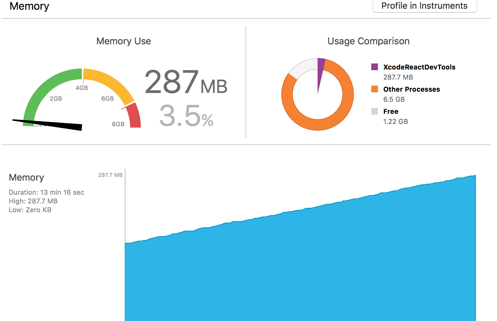
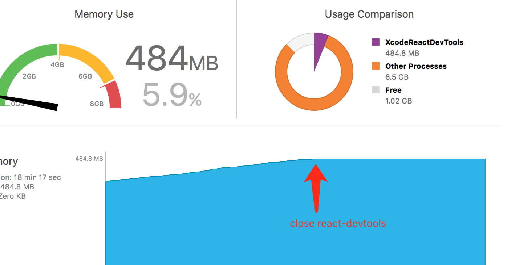

# XcodeReactDevTools

when I keep `react-devtools` opened, the xcode memory grows fast:

And when I close `react-devtools`, the xcode memory becomes smooth:

It can reproduce stablely with this project.

Is there something wrong?

